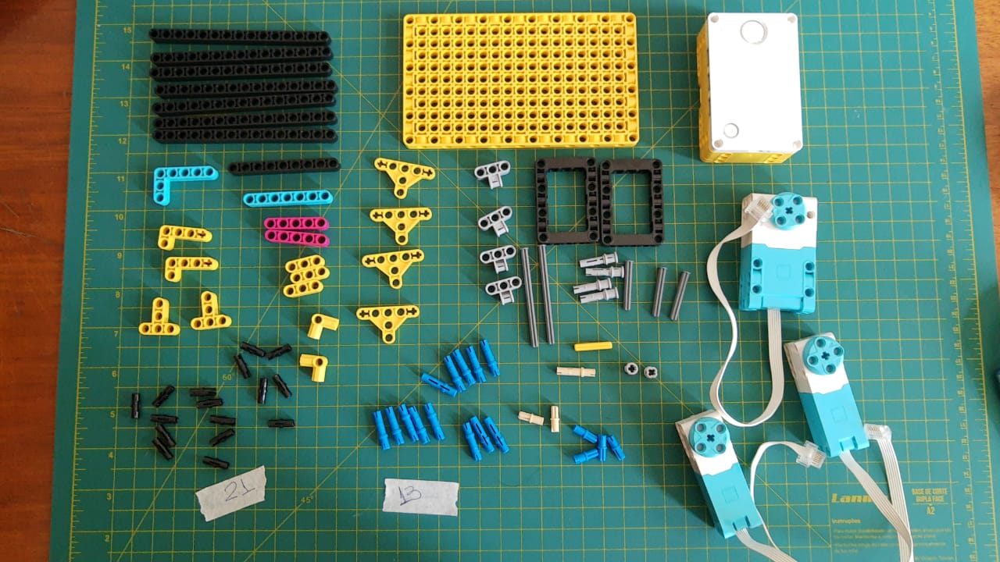

# MeArm_Spike
Criando um  MeArm com Lego Spike Prime

Criando MeArm baseado https://www.youtube.com/watch?v=UFfT0JtN1sA&feature=youtu.be by TESSLAB Robotics

Todos os componentes de montagem 

motor grande com base amarela
0x29: https://youtu.be/UFfT0JtN1sA?t=29

2 estrutura para apoiar os braços utilizando o motor grande como apoio:
0s39: https://youtu.be/UFfT0JtN1sA?t=39

eixo traseira que estrutura as barras do braço:
0s45: https://youtu.be/UFfT0JtN1sA?t=45

motor pequeno que traciona o eixo traseiro e apoio na estrutura dos braços:
1m07: https://youtu.be/UFfT0JtN1sA?t=67

